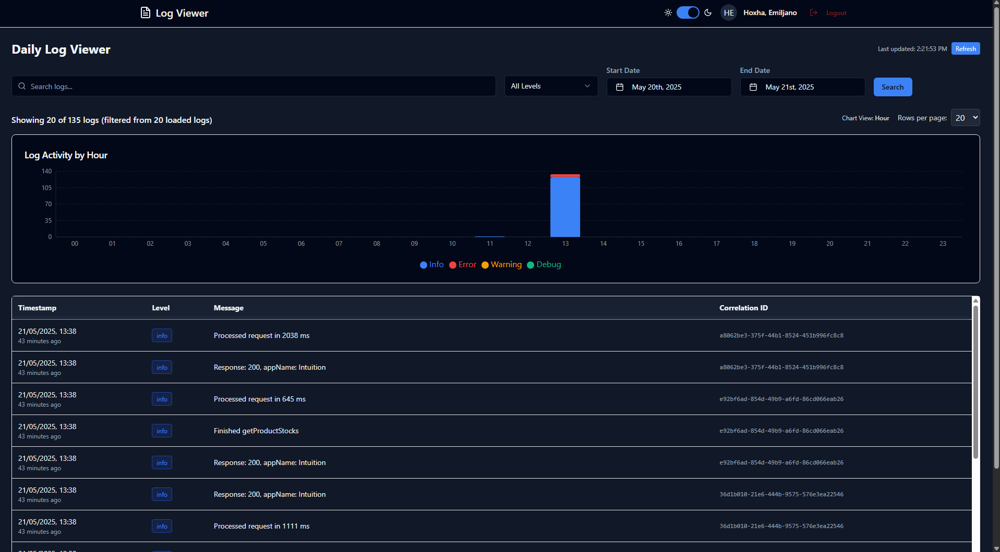

# Web Viewer JSON Logging

<div align="center">


</div>

A modern, feature-rich application for visualizing, analyzing, and monitoring JSON log files with advanced filtering capabilities and interactive data visualization.

## 🌟 Features

- **Interactive Log Visualization**: View log data through responsive, interactive charts powered by Recharts
- **Advanced Filtering**: Filter logs by date range, log level, search terms, correlation IDs, and more
- **Real-time Monitoring**: Auto-refresh capability keeps your log view up-to-date
- **Secure Authentication**: Microsoft Azure Active Directory integration for secure access
- **Responsive Design**: Modern UI that works seamlessly on desktop and mobile devices
- **Dark/Light Theme**: Choose your preferred viewing experience
- **Detailed Log Inspection**: In-depth view of log entries including all custom fields
- **Interactive Charts**: Click on chart segments to filter logs by time period and log level

## 🔍 Screenshots

<div align="center">
```html
<div class="screenshot-grid">
   
</div>

<p><em>Screenshots of the application showing the dashboard, detailed log view, and filtering capabilities</em></p>
```
</div>

## 🏗️ Architecture

The application follows a client-server architecture:

- **Frontend**: React + TypeScript application with:
  - Recharts for data visualization
  - ShadCN UI components
  - Context-based state management
  - Responsive design with Tailwind CSS
  - Microsoft Authentication Library (MSAL) integration

- **Backend**: Node.js + Fastify application with:
  - RESTful API endpoints for log data retrieval
  - Authentication middleware for Azure AD token validation
  - Efficient log parsing and processing
  - Comprehensive audit and analytics capabilities

## 🚀 Running with Docker

### Prerequisites
- [Docker](https://www.docker.com/) and [Docker Compose](https://docs.docker.com/compose/)

### 1. Build and Start the Application

From the project root, run:

```powershell
docker-compose up --build
```

- This will build both the Fastify backend and the React frontend, and start Nginx to serve the frontend and proxy API requests.
- The app will be available at: [http://localhost](http://localhost)

### 2. Stopping the Application

To stop the containers, press `Ctrl+C` in the terminal, then run:

```powershell
docker-compose down
```

### 3. Logs Directory

If you want to use a custom logs directory, you can mount a volume in `docker-compose.yml` under the `fastify` service:

```yaml
    volumes:
      - ./logs:/app/server/logs
```

## 📊 Log Format

The application supports **both JSON and plain text log formats**. It will automatically detect and parse files named in either format for each day.

### JSON Log Format

The application expects JSON log files with the following format:

```json
{
  "@timestamp": "2025-04-22T14:11:38.372Z",
  "level": "info",
  "message": "Incoming request: GET /api/v1/info",
  "correlationId": "7c086686-45d2-4fc1-b2da-0153fef6b839",
  "service": "app-service",
  "environment": "PROD"
  // ...any additional fields are supported
}
```

### Plain Text Log Format

The app also supports plain text logs with lines like:

```
[2025-04-22T14:11:38.372Z][info][AppKernel][Startup] Application started successfully
```

Required fields (for both formats):
- `@timestamp`: ISO timestamp
- `level`: Log level (info, warn, error, debug)
- `message`: Log message text

Optional fields (enhance functionality):
- `correlationId`: For tracking related log entries
- Any additional fields will be displayed in the log details view

## 🔐 Authentication

Authentication is handled through Microsoft Azure Active Directory:

1. Configure Azure AD in your environment file:
   ```
   AUTH_ENABLED=true
   AZURE_TENANT_ID=your-tenant-id
   AZURE_CLIENT_ID=your-client-id
   ```

2. Set required scopes (default is "User.Read")

3. Authentication can be disabled for development by setting `AUTH_ENABLED=false`

## 🌐 API Endpoints

| Endpoint | Method | Description |
|----------|--------|-------------|
| `/api/logs` | GET | Get logs with pagination and filtering |
| `/api/auth/status` | GET | Check authentication status |

Query parameters for `/api/logs`:
- `page`: Page number (default: 1)
- `limit`: Items per page (default: 20)
- `level`: Filter by log level
- `search`: Search in message and correlationId
- `startDate`: Filter logs after this date
- `endDate`: Filter logs before this date

## Basic Installation
### Download
```
git clone https://github.com/NEXQ-Srl/Web-Viewer-JSON-Logging.git
```
### Create Image
```
docker build -t web-viewer-logs .
```
### Run
```
docker run -d \
--name webviewerlogs \
-p 9295:5000 \
-e VITE_AUTH_ENABLED="true" \
-e NODE_ENV="production" \
-e VITE_AZURE_TENANT_ID="a62a799d-0556-44ca-afc3-237b336510b7" \
-e VITE_AZURE_CLIENT_ID="4e411659-7ce2-4a73-ac10-74defdee39ea" \
-v /novaLogs:/app/server/logs \
web-viewer-logs```


## 🤝 Contributing

Contributions are welcome! Please feel free to submit a Pull Request.

## 📄 License

This project is licensed under the MIT License - see the LICENSE file for details.

## 📞 Support

For support, email support@nexq.it or open an issue on GitHub.
